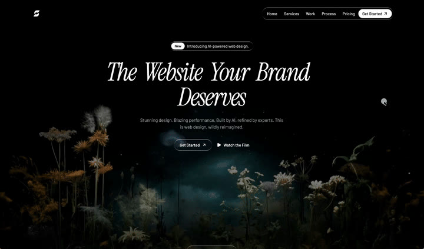
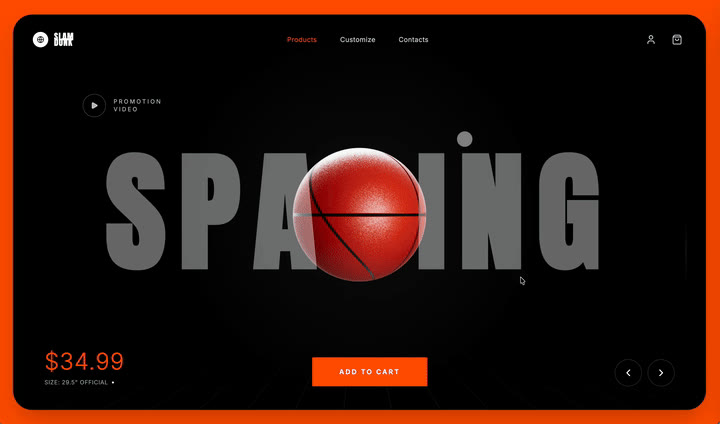
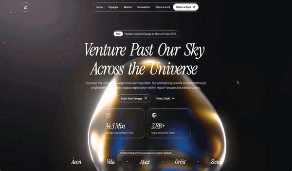
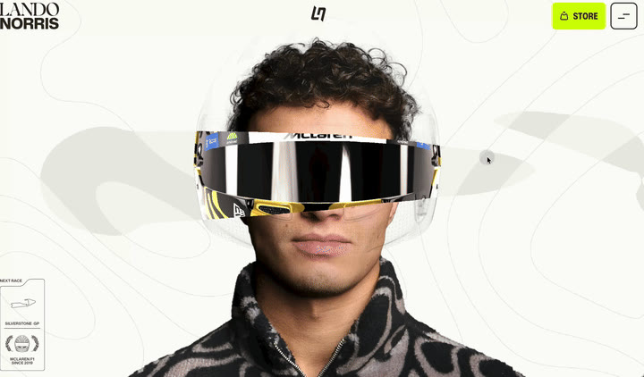
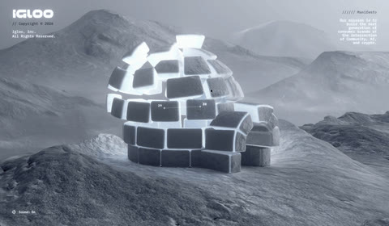

# 🌟 Web Beauty — AI 电影级网页复刻超级提示词库

[](https://opensource.org/licenses/MIT)
[](https://react.dev/)
[](https://claude.com/claude-code)

这是一个专门为现代 AI 编程助手（如 **Claude Code**, **Cursor**, **ChatGPT Codex**, **Windsurf** 等）深度定制的**高端落地页复刻提示词库与动效资产包**。

> 💡 **开源致谢与学习声明**：
> 1. **致敬原作**：本项目提示词与创意源文件**改编与整理自优秀开源项目 [xuanxuan-prompts](https://github.com/xuanxuan321/xuanxuan-prompts)**。感谢原作者 `@xuanxuan321` 设计的精妙动效与无私分享。
> 2. **学术与学习用途**：本项目所收录的提示词、媒体 CDN 直链和技术方案，仅供**前端动效开发、AI 提示词工程学习与学术研究**使用。复刻产物及对应媒体资源不得用于任何商业冒用或侵害原品牌权益的场景。

---

## 🚀 为什么选择本项目？

普通的提示词往往只能让 AI 编写出平庸、简陋的静态网页。
本项目通过**极细粒度的工程规格说明书（Spec）**，让 AI 编程助手化身**顶级动效大厂的前端专家**，100% 还原极其复杂的电影级交互动效。

### ✨ 攻克的业界动效技术壁垒：
1. **0.5px 发光高光边框（液态玻璃）**：使用 CSS 双层 `::before` 遮罩合成（`mask-composite: exclude`）算法，完美解决普通磨砂玻璃高光粗糙不透亮的问题。
2. **滚动视频无缝逐帧播放（Canvas Pre-render）**：在载入时后台离线 video 抽帧生成 `ImageBitmap` 序列，解决浏览器原生 video seek 时的 300ms 黑屏与卡顿，实现绸缎般的丝滑帧擦洗。
3. **光标跟随探照灯遮罩（Interactive Reveal）**：基于 CSS clip-path 动态计算光标坐标，实时透出下层隐藏的高精度图像。

---

## 🛠️ 快速上手指南

在 **Claude Code**、**Cursor** 或 **ChatGPT** 中：

1. 浏览下方的**精美动效项目矩阵**，挑选你想要实现的视觉风格。
2. 打开对应的子目录（例如 `basketball` 或 `liquidGlassAgency`）。
3. 复制该目录下的 `prompt.md` 的**全部文本内容**。
4. 在你的 AI 编程助手终端或对话框中，直接粘贴并发送：
   ```text
   请根据以下规格说明书，在我的当前工作区生成对应的完整可运行项目：
   [在此粘贴复制的 prompt.md 提示词内容]
   ```
5. AI 会自动帮你配置好开发环境（React/Vite等），写出完整代码，你只需按照它的提示一键运行（如 `npm run dev`）即可！

---

## 🎨 精美动效项目矩阵

> 💡 **提示**：为避免首次打开页面卡顿，下表预览已全部使用**静态高清封面图（Poster）**展示，确保极速加载，稳定不卡顿。

| 项目目录 | 动效亮点 & 技术栈 | 静态预览 |
| :--- | :--- | :---: |
| **[liquidGlassAgency](./liquidGlassAgency/)** <br>*(深色液态玻璃 AI 工作室)* | 奢侈品级暗黑美学。手写 **0.5px 极细发光高光边框**。<br>**技术栈**：React + Vite + Tailwind + shadcn/ui + Framer Motion |  |
| **[openDoor](./openDoor/)** <br>*(Unleash Sliding 门视频)* | **HLS 视频流平滑滚动逐帧定位**。鼠标悬停在导航丸时，黑色流体从底部向上融化充盈，文字反色。<br>**技术栈**：React 19 + Vite + Tailwind v4 + GSAP + hls.js |  |
| **[basketball](./basketball/)** <br>*(Slam Dunk 3D 运动商店)* | **程序化 3D 篮球交互**。随滚动叙事线旋转缩放，带加购飞入购物车特效、球鞋 3D 定制器及音效反馈。<br>**技术栈**：React + TS + Three.js (@react-three/fiber) + GSAP |  |
| **[blueEyes](./blueEyes/)** <br>*(NOVA_AI 视频滚动大字)* | 手写高吞吐量 React Canvas 视频**预抽帧图像位图（ImageBitmap）缓存算法**，彻底解决逐帧滚动 Seek 的闪烁卡顿。<br>**技术栈**：React + TS + Vite + Tailwind |  |
| **[bloom](./bloom/)** <br>*(赛博植物叙事单页)* | 生物机械质感、80px 高强模糊玻璃。Canvas 多段视频多重状态预抽帧合成动画。<br>**技术栈**：单文件 HTML/CSS/JS (零第三方构建依赖) |  |
| **[flower](./flower/)** <br>*(Veldara 发光花朵滚动)* | 滚动条化身视频时间轴。中段 3 张卡片在视口底部通过横向擦除效果交替出现，纯 Canvas 粒子漂移游走。<br>**技术栈**：纯原生单文件 HTML (零依赖，无 JS 框架) |  |
| **[interactiveDiscovery](./interactiveDiscovery/)** <br>*(地质探照揭示)* | **光标跟随手电筒滤镜（Interactive Reveal）**。鼠标移动产生柔和探照灯，实时透过上层图显露背后的隐藏高精扫描图。<br>**技术栈**：React + TS + Vite + Tailwind |  |
| **[liquidGlass](./liquidGlass/)** <br>*(太空旅行交叉淡入)* | 电影级双视频背景。利用 `requestAnimationFrame` 手写 **FadingVideo 双通道交叉淡入淡出**，极平滑过渡。<br>**技术栈**：单文件 HTML (React 18 CDN + Framer Motion) |  |
| **[helmet](./helmet/)** <br>*(Lando Norris 车手官网)* | **真实站点复刻**：引导 Agent 离线抓取并 1:1 重构 Lando Norris 官网，还原高质感赛车头盔/护目镜极具张力的 Hero 面板。 |  |
| **[iceHouse](./iceHouse/)** <br>*(Igloo.inc WebGL 冰屋)* | **真实站点复刻**：引导 Agent 离线抓取并完整还原 Igloo 官网沉浸式的重度 WebGL 3D 互动全景冰屋交互体验。 |  |

---

## 💎 动效实现核心逻辑（供开发者学习）

如果你想深入研究这些殿堂级落地页背后的技术，可以参考 `references/project_summary.md` 里的详细技术解析。以下是两段最核心的实现：

#### 1. 液态玻璃（Liquid Glass）荧光高光描边 CSS 核心算法
```css
.liquid-glass::before {
  content: '';
  position: absolute;
  inset: 0;
  border-radius: inherit;
  padding: 1.2px; /* 高光边框的极致物理厚度 */
  background: linear-gradient(
    180deg,
    rgba(255, 255, 255, 0.45) 0%,
    rgba(255, 255, 255, 0.15) 20%,
    rgba(255, 255, 255, 0) 40%,
    rgba(255, 255, 255, 0) 60%,
    rgba(255, 255, 255, 0.15) 80%,
    rgba(255, 255, 255, 0.45) 100%
  );
  -webkit-mask: linear-gradient(#fff 0 0) content-box, linear-gradient(#fff 0 0);
  -webkit-mask-composite: xor;
  mask-composite: exclude; /* 抠除卡片内部，只保留外边缘高光 */
  pointer-events: none;
}
```

#### 2. Canvas 预渲染抽帧防闪烁核心原理 (React)
```javascript
// 在挂载时将 24fps 视频全部转为 ImageBitmap 并存入缓存
async function cacheVideoFrames(videoUrl, targetFps = 18) {
  const video = document.createElement('video');
  video.src = videoUrl;
  video.muted = true;
  video.playsInline = true;
  video.crossOrigin = 'anonymous';
  await new Promise(resolve => video.onloadedmetadata = resolve);
  
  const duration = video.duration;
  const totalFrames = Math.min(144, Math.round(duration * targetFps));
  const frames = [];
  
  for (let i = 0; i < totalFrames; i++) {
    const time = (i / (totalFrames - 1)) * (duration - 0.02);
    video.currentTime = time;
    await new Promise(resolve => video.onseeked = resolve);
    const bitmap = await createImageBitmap(video, { resizeWidth: 840 });
    frames.push(bitmap);
  }
  return frames;
}
```

---

## 🛠️ 进阶功能：Tabbit Local Skill 集成 (可选)

本项目默认完美兼容 **Tabbit Agent** 本地 Skill 规范：
- 如果你目前或未来打算使用 Tabbit 浏览器助手，可以直接将本文件夹挂载。
- 文件夹内的 `SKILL.md` 会赋予智能体自动解析需求、精准路由到具体提示词并自动运行项目的能力，无须任何上传动作。

---

## 🤝 贡献与共建

如果你写出了更炫酷的网页复刻提示词（或复刻了其他顶级艺术网站），非常欢迎向本仓库提交 PR！

- **格式要求**：在根目录下新建文件夹，放入你的 `prompt.md`、`<项目名>.gif` 效果预览和 `.poster.jpg` 首帧封面。
- **推荐脚本**：你可以使用根目录下的 [`mp4-to-gif.sh`](./mp4-to-gif.sh) 脚本，一键把你的录屏 mp4 文件高保真地转换为符合 README 规范的 GIF 和封面图。
  ```bash
  ./mp4-to-gif.sh your_video.mp4
  ```

祝你的 AI 编程助手带给你更多震撼的视觉创作！🚀